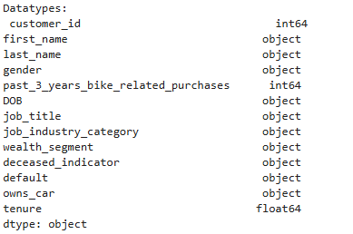
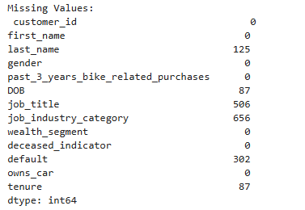

# Data-Cleaning-using-Python


## Project Overview
This project centers on data cleaning and anomaly detection for a customer dataset, to make it eligible for further analysis. The dataset contains customer information such as personal details, job industry, wealth segment, purchase history, and tenure.

## Objectives
The goal of this project was to clean and prepare a customer dataset by :

Handling missing values

Fixing inconsistent data

Detecting and handling outliers

Performing basic anomaly detection

Ensuring data quality for future use

### Tools

- Pyhton, Jupiter NoteBook

## About Dataset
The dataset contains information on customer demographics and transactions stored in a excel file, having the number of entries and columns stated below;

- Number of Entries: 4000 rows

- Number of Columns: 13


Key columns include:

**customer_id** – Unique identifier for each customer

**last_name** – Customer’s last name

**gender** – Categorical field with possible inconsistencies

**job_title** – Customer’s job title

**job_industry_category** – The industry the customer works in

**DOB** – Date of birth

**wealth_segment** - Category of csutoner according to wealth

**tenure** – Number of years as a customer

**past_3_years_bike_related_purchases** – Total purchases in the last 3 years

**owns_car** – Whether the customer owns a car (Yes/No)

**deceased_indicator** – Whether the customer is deceased (Yes/No)

## Data Cleaning Processes
To begin with, the necessary libraries were imported to read the excel file from the directory into a dataframe on jupiter notebook. Then, data qualities were probed by checking datatypes and missing values.

```
# import  libraries
import pandas as pd
import numpy as np

df = pd.read_excel(data.xlsx)

# display the datatypes for each columns
print("Datatypes:\n", df.dtypes)
```
---

---
```
# Check for missing values
print("Missing Values:\n", df.isnull().sum())

```
---

---
### Handling Missing Data

Columns | Issue | Solution Applied
|-------|-------|-----------------|
|last_name |Missing values |Filled with "Unknown" |
|job_title |Missing values |Filled with "Unknown" |
|job_industry_category |Missing values |Imputed based on most common category per job title |
|DOB |Missing values |Replaced with the median date of birth |
|tenure |Missing values |Replaced with the median tenure |

```
# replace missing values in the text columns ("last_name", "job_title") with "Unknown"
df.fillna({"last_name":"Unknown"}, inplace=True)
df.fillna({"job_title":"Unknown"}, inplace=True)

# Fill job_industry_category based on most common category per job_title
job_industry_mode = df.groupby("job_title")["job_industry_category"].apply(lambda x: x.mode().iloc[0] if not x.mode().empty else "Unknown")
df["job_industry_category"] = df.apply(lambda row: job_industry_mode[row["job_title"]] if pd.isna(row["job_industry_category"]) else row["job_industry_category"], axis=1)

# Ensure correct date format and replace missing values with median DOB
df["DOB"] = pd.to_datetime(df["DOB"], errors="coerce")
median_dob = df["DOB"].median()  # Calculate median DOB
df.fillna({"DOB":median_dob}, inplace = True)

# Replace missing values with median tenure
df.fillna({"tenure" : df["tenure"].median()}, inplace=True)
```

