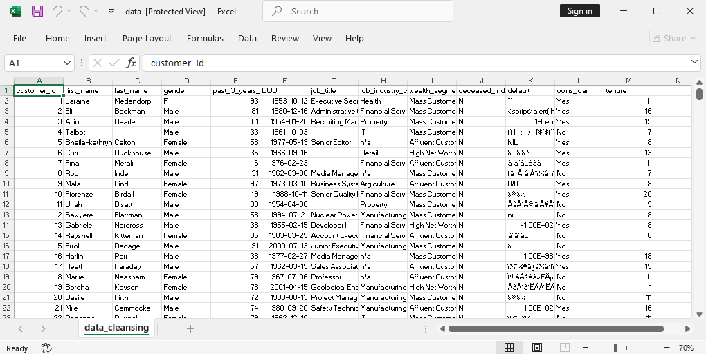

# Data-Cleaning-using-Python

## Project Overview
This project centers on data cleaning and anomaly detection for a customer dataset, to make it eligible for further analysis. The dataset contains customer information such as personal details, job industry, wealth segment, purchase history, and tenure.

## Objectives
The goal of this project was to clean and prepare a customer dataset by :

Handling missing values

Fixing inconsistent data

Detecting and handling outliers

Performing basic anomaly detection

Ensuring data quality for future use

### Tools

- Pyhton, Jupiter NoteBook

## About Dataset
The dataset contains information on customer demographics and transactions stored in a excel file, having the number of entries and columns stated below;

- Number of Entries: 4000 rows

- Number of Columns: 13

Key columns include:

**customer_id** – Unique identifier for each customer

**last_name** – Customer’s last name

**gender** – Categorical field with possible inconsistencies

**job_title** – Customer’s job title

**job_industry_category** – The industry the customer works in

**DOB** – Date of birth

**wealth_segment** - Category of csutoner according to wealth

**tenure** – Number of years as a customer

**past_3_years_bike_related_purchases** – Total purchases in the last 3 years

**owns_car** – Whether the customer owns a car (Yes/No)

**deceased_indicator** – Whether the customer is deceased (Yes/No)

## Data Cleaning Processes
